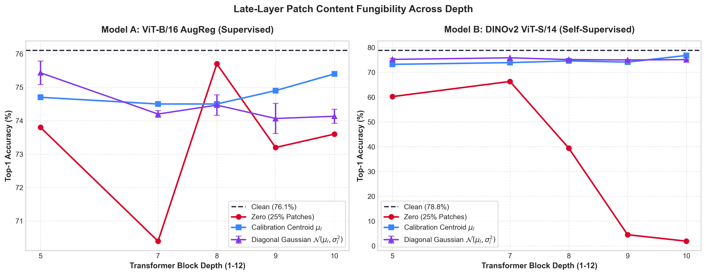
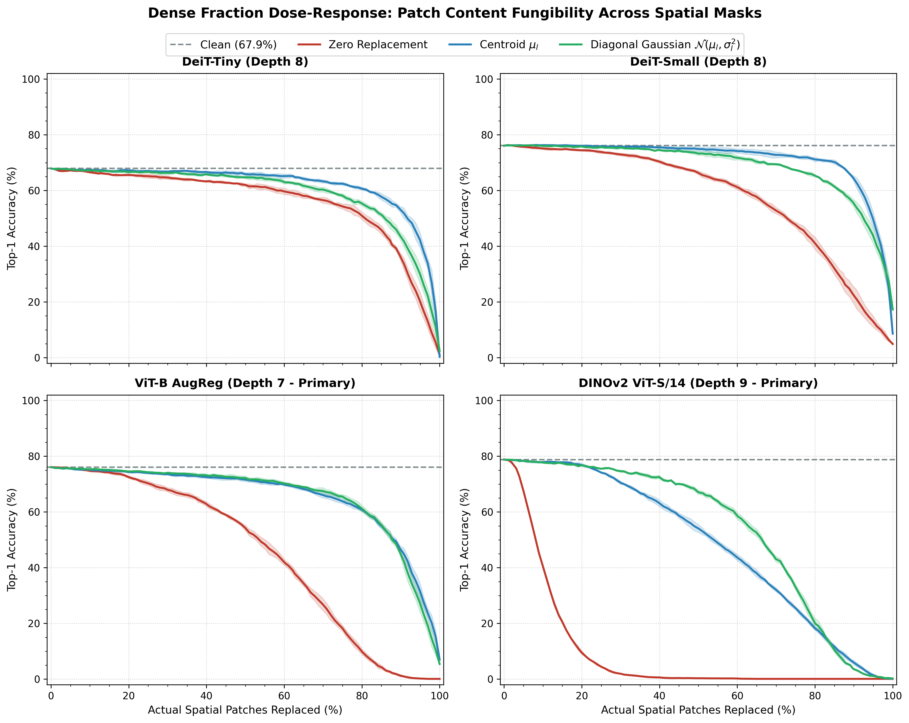
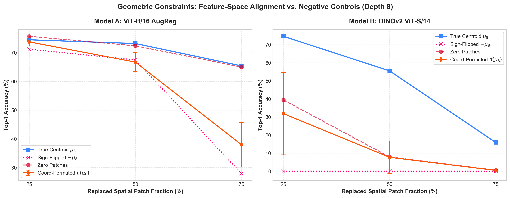
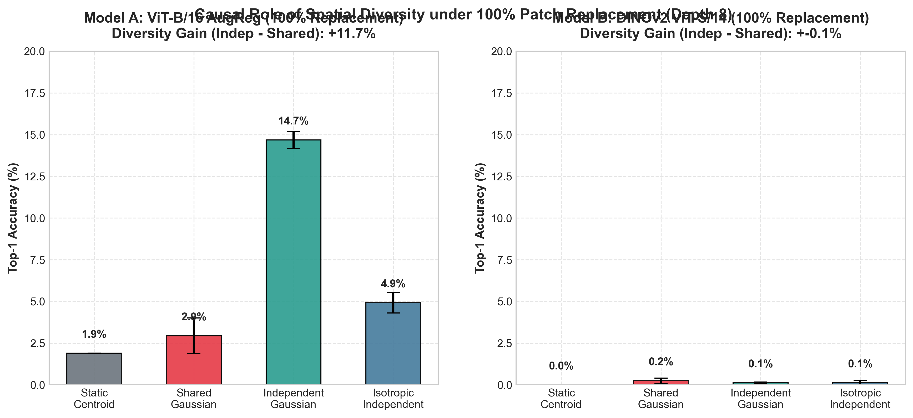
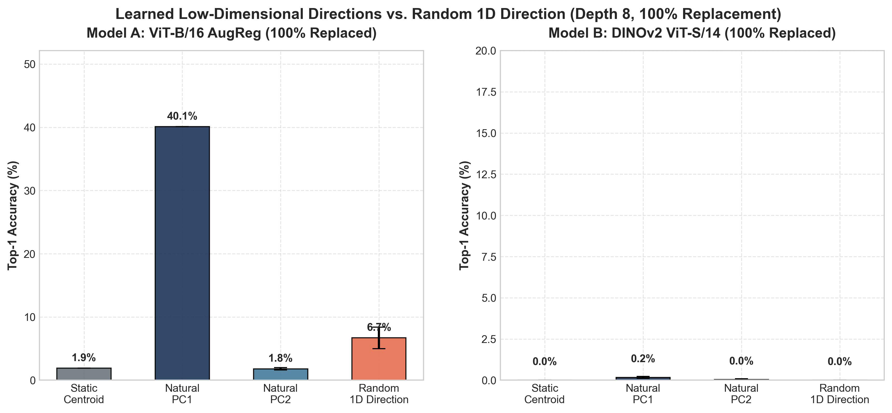
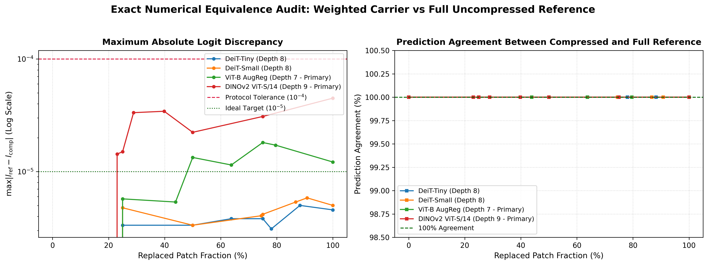
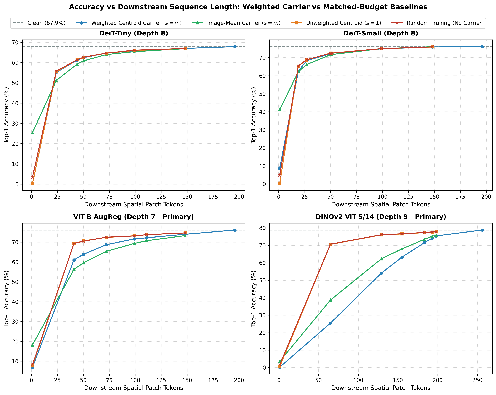
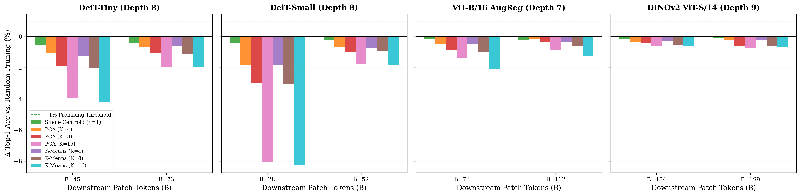

# Patch Content Fungibility in Vision Transformers: Geometric and Diversity Constraints in Late-Layer Representations

> Draft status: full manuscript draft after final robustness and compression-boundary audits.  
> Canonical numerical source: `docs/PAPER_EVIDENCE_TABLE.md`.  
> Claim boundaries: `docs/PAPER_CLAIMS_AUDIT.md`.  
> Do not introduce numerical values not present in the canonical evidence table.

## Abstract

Vision Transformers maintain spatial patch tokens throughout inference, but it is unclear which properties of those representations remain necessary after substantial global mixing. We study this question with causal activation substitution: after a selected Transformer block, we replace ordinary spatial patch activations while keeping the pretrained model, [CLS] state, sequence length, and remaining computation fixed. Across DeiT-Tiny, DeiT-Small, supervised ViT-B/16 AugReg, and self-supervised DINOv2 ViT-S/14, we identify a late regime of **patch content fungibility** in which class-agnostic calibration centroids or coarse Gaussian surrogates preserve downstream classification far better than destructive zero replacement. This tolerance is structured rather than arbitrary. Coordinate permutation and sign inversion strongly degrade valid surrogates, revealing a constraint from learned feature geometry; under complete patch-stream replacement, independent rather than identical surrogate tokens substantially improve downstream function, revealing a causal dependence on token-to-token diversity. Learned one-dimensional variation further outperforms matched random directions, showing that useful diversity is direction-specific. Dense fraction sweeps and multiple spatial masks establish robustness across architectures and intervention budgets. Finally, exact collapse of duplicate surrogate states yields real sequence-level speedups but does not outperform matched-budget pruning, separating representational replaceability from practical compressibility. These results provide a mechanistic characterization of what late ViT patch streams must preserve after exact patch-specific content becomes dispensable.

## 1. Introduction

Vision Transformers maintain a sequence of spatial patch tokens across many layers, even after those tokens have repeatedly exchanged information through self-attention. Early in the network, this design is intuitive: each patch token begins as a representation of a particular image region, and preserving its content appears necessary for visual processing. Later in the network, however, repeated global interaction makes the semantic role of an individual patch less obvious. A late patch representation may still occupy a spatial slot, yet its downstream function need not depend on retaining the exact image-specific content that originally entered that slot. This raises a basic mechanistic question: **what information must remain in late spatial patch activations for downstream Vision Transformer classification to function?**

Existing work has largely approached patch redundancy from an efficiency or attribution perspective. Token pruning and token merging ask which tokens can be removed or combined while preserving predictions, whereas attribution methods estimate which existing activations are important for a particular output. These approaches are valuable, but they do not directly answer whether a retained spatial token must preserve its own image-specific representation. Removing a token changes sequence length and downstream computation; measuring sensitivity leaves the representation itself unchanged. We instead hold the token slots and downstream architecture fixed and intervene directly on the content carried by ordinary spatial patch activations.

Our central experiment is activation substitution. For a frozen pretrained Vision Transformer, we run an image normally up to a chosen intermediate depth, keep the classification token untouched, and replace a controlled subset of spatial patch activations before continuing the remaining blocks. Replacement vectors are derived only from a disjoint calibration set and do not use the evaluation image, its label, or gradients. This setup lets us separate several questions that are often conflated. Does downstream computation require the exact image-specific patch vector, or merely a plausible late-layer representation? If a generic substitute works, must it align with the learned feature coordinates? If the entire real patch stream is removed, does downstream computation require the replacement tokens to remain distinct from one another?

The first result is that **late patch content becomes strongly fungible**. In DeiT-Tiny and DeiT-Small, replacing 25% of late patch activations with a single calibration centroid recovers 93.8% and 97.5% of the margin damage induced by zero replacement at Depth 8. The same phenomenon generalizes beyond the DeiT family: ViT-B/16 AugReg recovers 81.8% of zero damage at its strongest late window, while DINOv2 ViT-S/14 recovers 93.4% at Depth 9. In DINOv2, the contrast is particularly stark: zeroing only 25% of late patches drops Top-1 accuracy from 78.8% to 4.5%, whereas substituting a class-agnostic calibration centroid restores it to 74.1%. Thus, the downstream network can be highly sensitive to the presence and form of the patch stream while remaining surprisingly insensitive to the exact image-specific content of many individual patch activations.

This fungibility is not equivalent to arbitrary replacement. Geometry-preserving controls reveal that the surrogate activation must remain aligned with the learned late-layer feature space. In ViT-B, replacing 75% of patches with the correct centroid retains 65.4% Top-1 accuracy, but permuting the centroid's feature coordinates reduces accuracy to 38.0%, and sign inversion reduces it to 27.9%. In DINOv2, replacing 25% of patches with the correct centroid retains 74.6% accuracy, whereas coordinate permutation drops to 31.8% and sign inversion to 0.1%. These interventions preserve broad scale statistics while destroying feature-coordinate identity or orientation. The result is a more precise characterization than simple redundancy: late patch content is fungible only within a constrained region of learned representation geometry.

A second boundary emerges when the entire spatial stream is replaced. If every replacement token is identical, downstream computation collapses. Holding the marginal replacement distribution fixed while sampling tokens independently instead of broadcasting a shared vector produces large gains in CLS-readout models: +25.32 percentage points in DeiT-Tiny, +37.08 points in DeiT-Small, and +11.74 points in ViT-B. DINOv2 differs because its official classifier directly consumes the mean final patch representation; under 100% replacement, Top-1 accuracy remains at floor for both shared and independent replacements. Even there, independent variation improves true-class margin by 1.124 with a paired effect size of (d_z=0.301). We therefore treat token-to-token diversity as a strong causal requirement under complete replacement in CLS-readout models, with supporting margin-level evidence under DINOv2's pooled readout rather than claiming universal accuracy rescue.

The structure of this required variation is also informative. A single learned principal direction can provide substantial recovery relative to a matched random one-dimensional direction: 18.64% versus 10.80% in DeiT-Tiny, 28.08% versus 20.78% in DeiT-Small, and 40.10% versus 6.70% in ViT-B. However, earlier controls show that this effect depends on both direction and amplitude, so we do not claim that arbitrary rank-one variation is sufficient. Instead, the result suggests that downstream blocks are selectively compatible with low-dimensional variation aligned to learned late-layer geometry.

Together, these findings support a simple picture of late Vision Transformer computation. Patch tokens begin as image-specific spatial representations, but after repeated global interaction their exact content becomes progressively less necessary for classification. What remains necessary is not the original patch identity itself, but compatibility with the learned feature geometry and, under complete stream replacement, sufficient token-to-token variation to sustain downstream computation. We refer to this regime as **patch content fungibility**.

This paper makes four contributions. First, we introduce a causal activation-substitution framework and use it to identify **late patch content fungibility** in ordinary spatial ViT tokens: after sufficient depth, downstream classification can tolerate removal of much of their exact image-specific content while token slots and the remaining network are held fixed. Second, we causally decompose the phenomenon and show that fungibility is structured by **feature geometry** and, under complete stream replacement, **token-to-token diversity**; learned low-dimensional directions provide an additional probe of this structure. Third, we show that the phenomenon generalizes across DeiT, supervised ViT-B, and self-supervised DINOv2 and remains robust across dense replacement fractions and five independently sampled spatial masks. Fourth, we establish a boundary between **representational replaceability and practical compressibility**: duplicate surrogate states admit exact multiplicity-aware collapse, yet simple matched-budget pruning outperforms generic synthetic carriers. The paper therefore contributes a mechanistic characterization rather than a new acceleration algorithm.

The remainder of the paper is organized as follows. Section 2 positions patch content fungibility relative to token pruning, token merging, attribution, register-token analyses, and representation redundancy. Section 3 defines the intervention framework and calibration protocol. Section 4 characterizes the emergence of content fungibility with depth. Section 5 isolates geometric constraints on valid replacements. Section 6 studies token-to-token diversity under complete stream replacement. Section 7 examines low-dimensional replacement structure. Section 8 evaluates cross-architecture and cross-training-regime generalization. Section 9 discusses limitations and implications for representation analysis and future compression methods.

## 2. Related Work

### 2.1 Vision Transformer patch representations

Vision Transformers represent an image as a sequence of patch embeddings and propagate those tokens through a stack of self-attention blocks, typically with a dedicated classification token used for image-level prediction (Dosovitskiy et al., 2021). DeiT showed that this architecture can be trained effectively on ImageNet with data-efficient recipes and distillation (Touvron et al., 2021), while DINOv2 demonstrated that self-supervised ViT backbones can learn highly transferable visual representations at scale (Oquab et al., 2023). These works establish patch tokens as the basic spatial computational units of modern ViTs, but they do not ask whether a late patch slot must preserve the exact image-specific representation that arrived at that slot.

Recent analyses have made the distinction between global and local token roles increasingly explicit. Darcet et al. (2024) identified high-norm artifact tokens in ViT feature maps that are often located in low-information background regions and appear to be repurposed for internal computation, motivating the introduction of dedicated register tokens. Marouani et al. (2026) further studied the interaction between [CLS] and patch tokens and found that standard ViTs implicitly differentiate their processing despite sharing nominally identical architectural operations. Their results support the broader view that patch-token function evolves with depth and need not remain equivalent to local image content. Our question is narrower and intervention-based: once a model has reached a late layer, what properties of the ordinary spatial patch activations must actually be preserved for the remaining computation to succeed?

### 2.2 Token pruning, merging, and late-token redundancy

A large efficiency literature demonstrates that not all visual tokens need to be propagated at full cost. DynamicViT learns input-dependent token importance and progressively prunes tokens, obtaining substantial FLOP and throughput reductions with little accuracy loss (Rao et al., 2021). Token Merging (ToMe) instead combines similar tokens without retraining, reducing sequence length while preserving aggregate information and improving throughput across image, video, and audio transformers (Bolya et al., 2023). Related dynamic-computation methods similarly adapt token count or computation to image difficulty.

More recently, analyses of vision-language models have reported strong depth dependence in visual-token utility. Wang et al. (2026) describe an “information horizon” beyond which visual-token information becomes increasingly uniform or redundant and show that random late-layer token pruning can be competitive with importance-based pruning in that regime. Although this result concerns VLLMs rather than standalone image-classification ViTs, it reinforces a recurring observation: the functional role of visual tokens changes substantially with depth.

Our study differs from pruning and merging in a key experimental respect. We **do not remove, skip, or combine token slots** in the core experiments. Sequence length and downstream Transformer structure are held fixed. Instead, we overwrite the *content* of selected spatial activations and ask which representational properties remain necessary. This separation matters because a token can be redundant in content while its slot, geometry, or token-to-token variation remains computationally useful.

Centroid-based replacement itself is not new. CCViT (Yan et al., 2023) uses k-means centroids to replace a subset of **input image patches during self-supervised pre-training**, where the model is trained to reconstruct corrupted inputs and centroid-related targets. Our use of centroids serves a different purpose: the pretrained model is frozen, the intervention occurs on **internal late-layer patch activations**, and the centroid is a causal probe of whether downstream computation still requires the original image-specific activation. We therefore do not claim centroid substitution as a method contribution.

### 2.3 Causal interventions on internal visual representations

Attribution methods traditionally estimate which image regions or tokens influence a prediction using gradients, attention, relevance propagation, or input perturbations. Causal Attribution via Activation Patching (CAAP; Izadi et al., 2026) moves closer to the interventionist perspective by directly transplanting internal patch representations between source and neutral target contexts to measure patch-level causal contribution. CAAP is designed to produce faithful spatial attribution maps: it asks *which contextualized patch representation contributes to a target prediction?*

Patch content fungibility asks a different causal question. Rather than identifying the importance of a specific source patch, we hold the evaluation image and token slots fixed and replace selected activations with class-agnostic calibration-derived surrogates. The dependent variable is not patch attribution but the downstream model's ability to continue computing under controlled loss of image-specific content. Thus, the two paradigms share activation-level intervention but differ in estimand: CAAP measures causal contribution of patch-associated evidence, whereas our substitutions test the **necessity of exact representational content** and isolate the geometric and diversity constraints that remain after that content is removed.

### 2.4 Registers and the limits of zero ablation

The closest methodological precedent is recent work on register-token ablation. Darcet et al. (2024) introduced register tokens after observing that some ViT patch tokens become high-norm computational artifacts. Parodi et al. (2026) subsequently showed that zero-ablation can substantially overstate dependence on exact register content: replacing DINO register activations with means, noise, or cross-image register values preserves performance far better than replacing them with zeros. Their results demonstrate that a large zero-ablation effect need not imply dependence on the precise image-specific activation value.

Our work adopts the same general methodological lesson—**zero is a destructive control, not a sufficient estimate of content necessity**—but studies a different object and extends the intervention logic substantially. We operate on ordinary spatial patch tokens rather than auxiliary registers, including models with no register tokens. We vary replacement fraction and depth, test coordinate permutation and sign inversion to isolate feature-space geometry, contrast shared and independent replacements to isolate token-to-token diversity, and examine learned low-dimensional variation. The resulting question is therefore not whether specialized registers require exact content, but what computational constraints remain when image-specific information is removed from the ordinary late spatial stream.

### 2.5 Positioning

The literature above establishes four adjacent facts: ViT patch roles evolve with depth; many visual tokens can be pruned or merged; internal activation interventions can measure causal patch effects; and zero-ablation can exaggerate content dependence in specialized register tokens. Patch content fungibility connects these observations but targets a distinct representational object. Our core contribution is a controlled substitution framework that keeps token slots and downstream computation fixed while separating **exact content**, **feature geometry**, and **token diversity** as experimentally manipulable factors in late spatial patch representations.

## 3. Patch Content Fungibility Framework

### 3.1 Problem formulation

Consider a pretrained Vision Transformer with \(L\) Transformer blocks. For an input image \(x\), let the token sequence after block \(\ell\) be

$$
H^{(\ell)}(x)
=
\left[
c^{(\ell)}(x);
p_1^{(\ell)}(x),\ldots,p_N^{(\ell)}(x)
\right]
\in
\mathbb{R}^{(N+1)\times D},
$$

where \(c^{(\ell)}\) is the classification token and \(p_i^{(\ell)}\) is the activation at spatial patch position \(i\). The remaining network from this intervention point to the classifier is denoted \(F_{>\ell}\).

Our goal is not to determine whether patch position \(i\) is important in isolation. Instead, we ask whether the remaining computation requires the **exact image-specific value** \(p_i^{(\ell)}(x)\). We run the image normally through block \(\ell\), overwrite selected spatial activations, and resume the untouched pretrained model:

$$
\tilde{y}=F_{>\ell}\!\left(\tilde{H}^{(\ell)}\right).
$$

For a spatial mask \(M\subseteq\{1,\ldots,N\}\),

$$
\tilde{p}_i^{(\ell)}
=
\begin{cases}
R_i^{(\ell)}, & i\in M,\\
p_i^{(\ell)}(x), & i\notin M,
\end{cases}
$$

while

$$
\tilde{c}^{(\ell)}=c^{(\ell)}(x)
$$

in all primary patch interventions. Thus, upstream image processing through block \(\ell\) is preserved, [CLS] remains image-specific, sequence length is unchanged, and only the content supplied by selected spatial slots to subsequent blocks is manipulated.

This distinction is central to interpretation. A successful late-layer substitution does **not** imply that the original image or earlier patch computation was unnecessary. It implies only that, conditional on the computation already performed up to depth \(\ell\), the downstream network does not require the exact activation values of the replaced spatial slots.

### 3.2 Calibration-derived surrogate representations

Replacement vectors are constructed from a calibration set strictly disjoint from the evaluation images. Let \(\mathcal{C}_{\ell}\) denote the collection of spatial patch activations extracted at depth \(\ell\) from the calibration set. No evaluation activations, labels, or gradients are used to construct replacements.

The calibration centroid is

$$
\mu_{\ell}
=
\frac{1}{|\mathcal{C}_{\ell}|}
\sum_{p\in\mathcal{C}_{\ell}} p.
$$

**Centroid substitution** replaces every selected patch with the same class-agnostic vector,

$$
R_i^{(\ell)}=\mu_{\ell}.
$$

The centroid is neither the representation of the current image nor the activation of any particular calibration image. It is a dataset-level prototype of a late patch state and therefore provides a stringent test of exact image-specific content necessity.

For **diagonal-Gaussian substitution**, we additionally estimate the per-coordinate calibration standard deviation \(\sigma_{\ell}\) and independently sample

$$
R_i^{(\ell)}
\sim
\mathcal{N}
\left(
\mu_{\ell},
\operatorname{diag}(\sigma_{\ell}^{2})
\right).
$$

This preserves coarse coordinate-wise first- and second-order statistics without preserving image-specific content, cross-coordinate covariance, or original patch identity. We deliberately describe this intervention as moment matching rather than manifold matching.

### 3.3 Destructive and geometric controls

Zero replacement,

$$
R_i^{(\ell)}=0,
$$

serves as a destructive baseline. Zero simultaneously removes image-specific content and introduces a potentially severe activation-distribution shift. Accordingly, claims of fungibility are based on the contrast between zero and calibration-derived replacements rather than on zero sensitivity alone.

To test whether any nonzero vector with similar global scale is sufficient, we use geometry-destroying controls. A **coordinate-permuted centroid** applies a frozen bijection \(\pi\) to the feature dimensions,

$$
R_i^{(\ell)}=\pi(\mu_{\ell}),
$$

preserving the multiset of coordinate values and therefore scalar mean, variance, and \(L_2\) norm while destroying feature-coordinate correspondence. A **sign-inverted centroid** uses

$$
R_i^{(\ell)}=-\mu_{\ell},
$$

preserving norm while reversing orientation. Large performance differences between \(\mu_{\ell}\) and these controls indicate that successful substitution depends on learned feature geometry rather than merely nonzero activation magnitude.

### 3.4 Isolating token-to-token diversity

When every spatial patch is replaced, centroid substitution removes all variation across patch slots. To isolate whether downstream computation requires token-to-token diversity independently of the marginal replacement distribution, we compare shared and independent Gaussian interventions with matched per-token statistics.

In the **shared** condition, one Gaussian sample is drawn for an image and broadcast to every replaced spatial position:

$$
R_i^{(\ell)}=\mu_{\ell}+\epsilon
\qquad \forall i.
$$

In the **independent** condition, each spatial token receives its own sample:

$$
R_i^{(\ell)}
=
\mu_{\ell}+\epsilon_i,
\qquad
\epsilon_i
\overset{\mathrm{i.i.d.}}{\sim}
\mathcal{N}
\left(
0,\operatorname{diag}(\sigma_{\ell}^{2})
\right).
$$

The expected per-token norm and marginal distribution are therefore matched; the principal manipulated variable is whether different spatial slots carry distinct values.

### 3.5 Low-dimensional replacement variation

To determine whether useful diversity must occupy the full feature space, we eigendecompose the covariance of centered calibration patch activations. Let \(v_k\) and \(\lambda_k\) denote eigenvectors and eigenvalues. A natural one-dimensional replacement along component \(k\) is

$$
R_i^{(\ell)}
=
\mu_{\ell}
+
z_i\sqrt{\lambda_k}\,v_k,
\qquad
z_i\sim\mathcal{N}(0,1).
$$

We compare learned principal directions with random unit directions under matched variance. Because the response depends on both direction and amplitude, we treat low-dimensional recovery as a directional probe rather than claiming generic rank-one sufficiency.

### 3.6 Spatial masks and replacement fraction

Spatial positions are selected independently of image content, labels, attention scores, activation norms, or saliency. A seeded random permutation of the \(N\) spatial positions defines a nested family of masks: larger replacement fractions extend the same ordered prefix rather than selecting unrelated subsets.

Discovery experiments use frozen deterministic masks specified by their protocols. A final robustness analysis evaluates 101 requested replacement fractions from 0% to 100% over five independent spatial permutations. The purpose of this sweep is to test sensitivity to spatial subset choice and to characterize the continuous dose-response, not to select favorable operating points.

### 3.7 Models, data isolation, and forward validation

We study four frozen pretrained Vision Transformer settings: `deit_tiny_patch16_224` (DeiT-Tiny, (D=192)), `deit_small_patch16_224` (DeiT-Small, (D=384)), `vit_base_patch16_224.augreg_in1k` (supervised ViT-B/16 AugReg, (D=768)), and `dinov2_vits14_lc` with `layers=1` (self-supervised DINOv2 ViT-S/14, (D=384), no registers, official ImageNet linear head). All have 12 Transformer blocks. The first three produce 196 spatial tokens at (224	imes224) input resolution; DINOv2 produces 256. DeiT and ViT-B classify from [CLS], whereas the evaluated DINOv2 head consumes the concatenation of normalized [CLS] and the mean normalized patch representation. This readout difference is explicitly accounted for when interpreting complete-stream replacement.

Calibration and evaluation each contain 1,000 ImageNet-1k validation images, sampled deterministically as one image per class. The calibration split uses seed 9101 and the evaluation split seed 9201, with exact zero image overlap. All calibration statistics are computed exclusively from calibration activations and without labels. All model weights and classifier heads remain frozen. Official model preprocessing is used for each checkpoint; in particular, ViT-B AugReg uses its checkpoint-specific resize/crop and normalization configuration, while DINOv2 uses its official ImageNet evaluation preprocessing. For ViT-B and DINOv2, the manual block-by-block intervention paths were verified against the untouched official forward implementation before scientific evaluation, with exact prediction agreement in the parity audit.

### 3.8 Evaluation metrics

For each image we record the true-class logit, strongest incorrect logit, true-class margin, Top-1 correctness, prediction flips, and directional correctness changes. Let \(m_{\mathrm{clean}}(x)\) and \(m_R(x)\) be the true-class margins under clean and replacement conditions. Mean margin damage is

$$
D_R
=
\mathbb{E}_x
\left[
m_{\mathrm{clean}}(x)-m_R(x)
\right].
$$

When zero replacement produces meaningful damage, we summarize how much of that destructive effect is avoided by replacement \(R\) using

$$
\operatorname{Recovery}(R)
=
\frac{D_{\mathrm{zero}}-D_R}
{D_{\mathrm{zero}}}.
$$

Recovery is treated as not applicable when zero damage is negligible. Statistical comparisons use the evaluation image as the independent unit, with paired margin comparisons, bootstrap confidence intervals, paired parametric and nonparametric tests, effect sizes, and exact McNemar tests for paired accuracy changes. Multiple stochastic replacement seeds are summarized before inferential comparisons rather than pooled as independent images.

### 3.9 Reproducibility controls

All intervention choices are frozen before the corresponding evaluation stage. Calibration and evaluation images are disjoint; [CLS] is untouched in primary patch interventions; replacement masks are content-independent; and model parameters remain unchanged. The final dense robustness sweep uses five spatial mask seeds (31001--31005), each defining one deterministic random permutation shared across all evaluation images, with nested prefix masks across fractions. Gaussian sampling seeds are kept separate from spatial-mask seeds. Integer replaced-token counts and realized fractions are logged explicitly because requested percentages do not always map exactly to integer patch counts. Programmatic validation checks verify split disjointness, mask nesting, fraction-zero clean parity, complete replacement at 100%, frozen weights, calibration-statistic identity, and unique result keys.

## 4. Emergence of Late Patch Content Fungibility

### 4.1 Exact patch content becomes dispensable only after sufficient depth

We first ask whether the downstream network requires the exact image-specific activation carried by a spatial patch token. The key comparison is not clean versus zero replacement, because zero simultaneously removes content and introduces a severe activation-distribution shift. Instead, we compare zero replacement with class-agnostic calibration surrogates constructed at the same depth.

The effect is strongly depth-dependent. In DeiT-Tiny and DeiT-Small, early and intermediate blocks remain sensitive to replacement, but a clear late window appears around Blocks 7--9, with the strongest separation at Depth 8. At 25% replacement, DeiT-Tiny falls from 67.90% clean Top-1 accuracy to 59.10% under zero replacement. Replacing the same patch positions with the held-out calibration centroid restores accuracy to 67.20%, with margin damage falling from 0.7632 to 0.0476, corresponding to 93.76% recovery of the zero-induced damage. A diagonal Gaussian constructed from held-out calibration statistics yields 66.68% accuracy and 87.86% recovery. DeiT-Small shows the same pattern more strongly: 76.10% clean accuracy falls to 69.60% under zero replacement, while the centroid restores 76.10% accuracy and recovers 97.54% of the margin damage; the diagonal Gaussian reaches 75.28% and 94.71% recovery.

The phenomenon is not specific to DeiT. ViT-B/16 AugReg exhibits its strongest late fungibility window at Depth 7 rather than Depth 8. At 25% replacement, zero yields 70.40% accuracy from a 76.10% clean baseline, whereas the calibration centroid reaches 74.50% and recovers 81.76% of zero-induced margin damage. DINOv2 ViT-S/14 exhibits an even sharper contrast at Depth 9. Zeroing 25% of its 256 spatial patches collapses accuracy from 78.80% to 4.50%, yet replacing the same positions with a class-agnostic centroid restores 74.10% and recovers 93.41% of the margin damage. Thus, strong zero sensitivity can coexist with weak dependence on the exact image-specific value of the affected patches.

The location of the strongest window varies across architectures: Depth 8 for the two DeiT models, Depth 7 for ViT-B, and Depth 9 for DINOv2. We therefore do not claim a universal block index at which patch content becomes fungible. The common pattern is instead a transition with depth: after substantial upstream mixing has already occurred, downstream computation becomes increasingly tolerant to losing the exact content of many ordinary spatial patch activations.

**Figure 1. Depth-dependent emergence of patch-content fungibility.** Frozen ViTs are intervened on after selected blocks while [CLS] remains untouched. The separation between destructive zero replacement and calibration-derived surrogates widens in late layers, with architecture-specific peak depths.

### 4.2 Fungibility persists over a broad replacement range

A coarse set of replacement fractions could in principle overstate the effect if the chosen fractions or patch positions happened to be favorable. We therefore perform a final dense sweep over 101 requested fractions from 0% to 100%, using five independent image-independent spatial permutations for each model. Within each permutation, replacement masks are nested, so increasing the fraction progressively extends the same spatial ordering.

The resulting dose-response is broad rather than isolated. In DeiT-Tiny at Depth 8, centroid substitution retains at least 95% of clean accuracy up to \(63.7\% \pm 1.4\%\) replacement, at least 90% up to \(77.9\% \pm 1.7\%\), and at least 80% up to \(88.5\% \pm 1.3\%\). Under zero replacement, the corresponding thresholds are only \(30.5\% \pm 4.6\%\), \(53.9\% \pm 2.7\%\), and \(75.0\% \pm 2.4\%\). DeiT-Small is still more tolerant: the centroid maintains 95%, 90%, and 80% of clean accuracy up to \(74.6\% \pm 4.9\%\), \(86.5\% \pm 1.0\%\), and \(91.0\% \pm 0.9\%\), respectively.

ViT-B and DINOv2 show the same qualitative separation while differing quantitatively. At ViT-B's primary Depth 7 window, diagonal-Gaussian replacement retains 95% of clean accuracy to \(49.2\% \pm 5.0\%\) replacement and 90% to \(67.4\% \pm 2.1\%\), compared with 20.1% and 28.3% under zero. DINOv2 is more sensitive in absolute terms, but the contrast is especially clear: zero falls below 90% of clean accuracy after only \(3.9\%\) replacement, whereas diagonal-Gaussian substitution remains above that threshold through 43.0% replacement.

Across the five tested spatial permutations, retention-threshold variability remains small relative to the separation between plausible replacements and zero. For the \(F_{90}\) and \(F_{80}\) thresholds, standard deviations are at most 1.7 percentage points in DeiT-Tiny, 1.0 in DeiT-Small, 2.1 in ViT-B, and approximately 1.1 or less in DINOv2. Point-wise accuracy spread can be larger at individual fractions, so we do not describe the phenomenon as spatially invariant. The appropriate conclusion is that patch-content fungibility is robust across independently sampled spatial subsets and is not explained by a single fortunate mask ordering.

**Figure 2. Continuous dose-response and spatial-mask robustness.** Top-1 accuracy is shown across the full replacement range with variability across five independently sampled, image-independent spatial masks. Centroid and diagonal-Gaussian substitutions remain substantially less destructive than zero over broad fraction intervals.

For centroid replacement in the supervised ViTs, the most abrupt local degradation occurs at the final transition to complete replacement, where the last remaining real patches disappear. This boundary behavior is consistent with, but does not by itself establish, the diversity mechanism isolated in Section 6.

## 5. Valid Substitutions Are Constrained by Learned Feature Geometry

The success of a class-agnostic centroid does not imply that any generic nonzero vector is acceptable. We next ask which properties make a surrogate compatible with downstream computation.

### 5.1 Coordinate identity and orientation matter

Coordinate permutation provides a direct control for feature-space alignment. Permuting the entries of the centroid preserves the multiset of coordinate values, its scalar mean and variance, and its \(L_2\) norm, while destroying which learned feature occupies which coordinate. In ViT-B at Depth 8 and 75% replacement, the correct centroid retains 65.40% Top-1 accuracy. Coordinate permutation reduces this to 38.00%, and sign inversion reduces it further to 27.90%. The underlying vector therefore cannot be treated as an unordered collection of activation magnitudes.

DINOv2 provides an even stronger test. At Depth 8 and only 25% replacement, the correct centroid yields 74.60% accuracy from a 78.80% clean baseline. Permuting its coordinates reduces accuracy to 31.80%, while sign inversion collapses it to 0.10%. DeiT-Tiny and DeiT-Small show the same orientation sensitivity at 75% replacement: the correct centroid yields 64.20% and 73.60% accuracy, respectively, whereas sign inversion yields 0.60% and 0.10%.

These controls rule out a weak interpretation in which late blocks merely require nonzero vectors with approximately correct norm or marginal scale. Successful substitution depends on compatibility with the learned feature-coordinate system and orientation of the late representation space. We use the term **geometry constraint** for this requirement, without claiming that the centroid or diagonal Gaussian recovers the full data manifold.

**Figure 3. Valid substitutions are constrained by learned feature geometry.** Coordinate permutation and sign inversion preserve coarse scale properties while disrupting learned feature-coordinate alignment, producing large performance losses relative to the correct calibration centroid.

### 5.2 Geometry is permissive, not exact

The geometry constraint is nevertheless substantially weaker than preserving the original image-specific activation. A single dataset-level centroid can replace a large fraction of patches, and independently sampled diagonal Gaussian vectors can remain effective despite discarding cross-coordinate covariance and all patch identity. Thus, downstream computation occupies an intermediate regime: exact content is unnecessary for many late patch slots, but arbitrary vectors remain destructive.

This distinction is central to patch content fungibility. The valid set of replacements is not one exact point corresponding to the original activation, nor is it the entire feature space. Rather, late computation tolerates a broad class of class-agnostic substitutes as long as they remain compatible with learned feature geometry.

## 6. Complete Stream Replacement Reveals a Causal Diversity Constraint

Partial replacement leaves a subset of real patches untouched. Those surviving patches provide image-specific variation even when every replaced slot receives the same centroid. To determine what happens when this source of variation is removed, we replace the entire spatial patch stream.

### 6.1 Identical replacement tokens are insufficient

At 100% replacement, broadcasting one identical vector to every patch position performs poorly. However, this failure alone does not reveal whether the problem is incorrect token energy, incorrect marginal statistics, or the absence of token-to-token variation. We therefore compare shared and independent Gaussian replacements drawn from the same calibration-derived marginal distribution.

In the shared condition, one Gaussian vector is sampled and copied to all patch positions. In the independent condition, each patch receives an independent sample from the same distribution. The expected per-token statistics are matched; the key manipulated property is whether the spatial tokens remain distinct.

The difference is large in all three CLS-readout architectures. In DeiT-Tiny, shared noise yields 1.02% accuracy, while independent noise reaches 26.34%, a gain of 25.32 percentage points. In DeiT-Small, accuracy rises from 9.28% to 46.36%, a 37.08-point gain. ViT-B rises from 2.94% to 14.68%, a gain of 11.74 points. Because the marginal replacement distribution is held fixed, these gains isolate a causal role for token-to-token diversity under complete stream replacement.

**Figure 4. Token-to-token diversity matters under complete replacement.** Shared and independent Gaussian replacements have matched marginal statistics but differ in whether spatial tokens carry distinct values. Independent variation strongly improves accuracy in CLS-readout models; DINOv2 provides margin-level rather than accuracy-level support because of its patch-mean readout.

### 6.2 DINOv2 exposes a readout-dependent boundary

DINOv2 requires a more conservative interpretation because its evaluated classifier directly consumes both normalized [CLS] and the mean normalized patch representation. Under complete replacement, both shared and independent Gaussian conditions remain near the accuracy floor: 0.24% and 0.12%, respectively. Accuracy therefore does not support a diversity-rescue claim in this architecture.

The true-class margin nevertheless improves from \(-9.0772\) under shared noise to \(-7.9532\) under independent noise, a gain of 1.124 with \(d_z=0.301\). We treat this as supporting evidence that diversity changes downstream computation, not as evidence that diversity alone restores DINOv2 classification. The contrast illustrates that the observable consequence of patch-stream interventions depends partly on classifier topology.

Taken together, the results support a strong diversity requirement for complete replacement in CLS-readout ViTs and a weaker margin-level effect in DINOv2. They do not imply that all diversity is equally useful; Section 7 shows that the direction of variation matters.

## 7. Useful Diversity Is Low-Dimensional but Direction-Specific

The independent-Gaussian experiments show that non-identical tokens matter, but they leave open whether useful variation must span the full feature space. We therefore restrict replacement diversity to one-dimensional subspaces.

For each model, we compare variation along a principal direction estimated from held-out calibration activations with variation along a random direction at matched energy. In DeiT-Tiny, natural PC1 variation reaches 18.64% accuracy, compared with 10.80% for an energy-matched random direction, a gain of 7.84 percentage points. DeiT-Small similarly reaches 28.08% with PC1 versus 20.78% for random one-dimensional variation. The strongest separation occurs in ViT-B: PC1 reaches 40.10% accuracy, while a matched random direction reaches only 6.70%.

DINOv2 again remains at an accuracy floor under complete replacement, but the learned direction improves the true-class margin from \(-8.6540\) for the matched random direction to \(-8.4383\). We therefore interpret its result at the margin level rather than as classification recovery.

These results establish two points. First, useful token diversity need not require high-dimensional independent noise: variation confined to a single learned direction can preserve substantially more downstream function than a static stream. Second, dimensionality alone is insufficient. A random one-dimensional direction with matched energy performs much worse, and separate amplitude controls show that response depends on scale. The appropriate conclusion is therefore not that late patch computation is generically rank-one, but that downstream blocks are selectively receptive to low-dimensional variation aligned with learned representation directions.

**Figure 5. Learned low-dimensional directions carry privileged downstream compatibility.** One-dimensional variation along the leading calibration principal direction outperforms energy-matched random directions, most strongly in ViT-B. The result is direction- and amplitude-dependent rather than evidence of generic rank-one sufficiency.

## 8. Cross-Architecture Synthesis

The central pattern replicates across four frozen ViT settings spanning model size, patch resolution, and training paradigm.

**Table 1. Cross-architecture synthesis of the primary fungibility window.**

| Model | Primary depth | Clean Top-1 | 25% zero | 25% valid surrogate | Zero-damage recovery | Dense \(F_{90}\) for best surrogate | Complete-replacement diversity evidence |
|---|---:|---:|---:|---:|---:|---:|---|
| DeiT-Tiny | 8 | 67.90% | 59.10% | Centroid 67.20% | 93.76% | Centroid \(77.9\%\pm1.7\%\) | +25.32 pp independent vs. shared |
| DeiT-Small | 8 | 76.10% | 69.60% | Centroid 76.10% | 97.54% | Centroid \(86.5\%\pm1.0\%\) | +37.08 pp independent vs. shared |
| ViT-B/16 AugReg | 7 | 76.10% | 70.40% | Centroid 74.50% | 81.76% | Gaussian \(67.4\%\pm2.1\%\) | +11.74 pp independent vs. shared |
| DINOv2 ViT-S/14 | 9 | 78.80% | 4.50% | Centroid 74.10% | 93.41% | Gaussian \(43.0\%\pm0.0\%\) | +1.124 true-class margin; accuracy at floor |

 Clean Top-1 accuracy is 67.90% for DeiT-Tiny, 76.10% for DeiT-Small, 76.10% for supervised ViT-B/16 AugReg, and 78.80% for self-supervised DINOv2 ViT-S/14. Despite substantial differences in zero sensitivity and readout topology, all four exhibit a late regime in which calibration-derived surrogates preserve downstream function far better than destructive zero replacement.

The precise operating point is architecture-dependent. DeiT-Tiny and DeiT-Small peak around Depth 8, ViT-B around Depth 7, and DINOv2 around Depth 9. The tolerated replacement fraction also differs markedly: DeiT-Small can retain at least 90% of clean accuracy under centroid substitution through approximately 86.5% replacement, whereas DINOv2's corresponding Gaussian threshold is 43.0%. These differences argue against a universal numerical law for late fungibility.

What generalizes is the qualitative structure. First, exact patch-specific content becomes substantially less necessary after sufficient depth. Second, class-agnostic replacements must remain aligned with learned feature geometry. Third, when the entire real patch stream is removed, token-to-token diversity changes downstream computation substantially, most clearly in CLS-readout models. Fourth, learned representation directions are more effective than arbitrary matched directions. The same causal hierarchy appears under both supervised and self-supervised pretraining.

DINOv2 also provides an important counterweight to overly broad conclusions. Its patch-mean readout makes it especially sensitive to complete patch-stream corruption, and its strongest diversity evidence appears in margin rather than Top-1 accuracy. We therefore regard the cross-model result as a shared representational phenomenon with architecture-specific expression, not as identical behavior at the same depth or replacement fraction.

## 9. Discussion

### 9.1 What patch content fungibility does and does not mean

The results do not show that image content, spatial patches, or early visual computation are unnecessary. Every intervention is applied only after the image has already passed through multiple Transformer blocks. The retained [CLS] state and any unreplaced spatial tokens remain image-conditioned, and earlier patch representations have already influenced the network through repeated self-attention. Our claim is conditional: **given the state reached at a late intervention depth, downstream classification often no longer requires the exact activation value of many individual spatial patch slots.**

This distinction separates content fungibility from token irrelevance. A patch slot can cease to require its exact image-specific content while still participating in downstream attention as a geometrically compatible state. The severe failures caused by zero, coordinate permutation, sign inversion, and complete diversity collapse show that the late patch stream remains computationally structured even when its exact content becomes replaceable.

### 9.2 A shift from content specificity to structural compatibility

A simple interpretation of the full intervention sequence is that the role of late patches changes with depth. Early patches must encode image-specific evidence. After repeated global mixing, part of that evidence has already influenced other tokens and the downstream network becomes less dependent on the exact state of each individual patch. What remains important is increasingly structural: the replacement should occupy a compatible region and orientation of feature space, and the patch stream should preserve sufficient variation across tokens when no real patches remain.

The geometry and diversity findings are therefore complementary rather than competing explanations. Geometry constrains **which individual surrogate states are acceptable**. Diversity constrains **the relationship among surrogate states across the token set**. The low-dimensional experiments further show that this diversity is not purely a matter of variance magnitude: learned directions are more compatible with the downstream computation than arbitrary directions of equal energy.

### 9.3 Replaceability is not the same as compressibility

The fixed-length design deliberately isolates representational necessity from sequence reduction. We nevertheless performed a separate proof-of-concept to test whether the discovered redundancy immediately yields a competitive compression method.

When many replaced patches are assigned the same centroid, their downstream states remain identical in the evaluated permutation-equivariant ViT blocks. Collapsing \(m\) identical centroid tokens into one multiplicity-aware carrier with an attention bias of \(+\log m\) reproduces the uncompressed centroid intervention to numerical precision: prediction agreement is 100%, with maximum absolute logit error \(4.49\times10^{-5}\). This establishes an exact computational redundancy within the intervention setting.

However, exact preservation of that redundancy is not the best use of a scarce token budget. At matched downstream sequence length, simple random pruning matches or exceeds the weighted carrier. For example, at the tested ViT-B Depth 7 operating point with 73 total downstream tokens, random pruning reaches 72.48% accuracy whereas the weighted carrier reaches 68.70%. DINOv2 shows a similar gap, 77.40% versus 71.48% at the corresponding tested budget. A subsequent geometry-diversity bank test likewise finds that allocating token slots to generic PCA, K-means, or random-direction carriers never outperforms spending those slots on additional real patches.

This negative result clarifies the scope of fungibility. **A representation can be replaceable when sequence structure is preserved without being the best candidate to replace when token capacity itself is scarce.** Geometry and diversity characterize valid substitutes in the fixed-length computation, but surviving real patches retain task-relevant image-specific information that generic class-agnostic carriers fail to replace under matched token budgets.

Sequence shortening can of course reduce computation: the weighted-carrier proof-of-concept produced measurable end-to-end latency reductions in larger models, including 32.3% in ViT-B and 18.4% in DeiT-Small at batch size 16 on the evaluated GPU. Because simple pruning achieves the same sequence reduction with equal or better accuracy, these speedups should be attributed to shorter sequences rather than to a new competitive compression method. We therefore treat the compression experiments as a boundary test of the mechanistic finding, not as an acceleration contribution.

**Supplementary application evidence.** The carrier-equivalence audit, latency measurements, and geometry-bank falsification are retained as boundary tests rather than headline results.

### 9.4 Relation to zero ablation and causal interpretation

The large gap between zero and calibration-derived replacements reinforces a general methodological point: destructive ablation measures more than content necessity. Setting an internal activation to zero changes content, norm, direction, and distributional compatibility at once. A large performance drop under zero therefore cannot by itself establish that the exact original activation was necessary.

Our substitution framework makes this distinction explicit. If zero is destructive but a class-agnostic calibration surrogate is tolerated, the downstream network depends on some properties of the activation without depending on its exact image-specific value. Geometry-destroying and diversity controls then identify which properties remain causally relevant. This layered intervention logic is the main reason we describe the result as content fungibility rather than simple redundancy.

### 9.5 Limitations

The study is limited to frozen image-classification ViTs evaluated on ImageNet-derived calibration and evaluation subsets. The phenomenon may differ in detection, segmentation, video, multimodal, or generative settings where spatial token identity can remain directly coupled to the output. The evaluated models also share the broad Transformer design family, even though they differ in scale and training paradigm.

Our interventions are intentionally late and conditional on all upstream computation having already occurred. They therefore cannot determine when or where the image-specific information carried by a replaced patch was transferred, integrated, or discarded. The experiments identify downstream necessity, not a complete information-flow decomposition.

The calibration centroid and diagonal Gaussian are deliberately simple probes. Their success demonstrates that exact content is unnecessary, but it does not characterize the complete set of valid late-layer states. Conversely, PCA-based low-dimensional controls identify compatible directions without proving that the natural representation is intrinsically one-dimensional.

The dense spatial-mask study covers five independently sampled permutations, which is sufficient to rule out dependence on the originally chosen mask but not to establish strict invariance over all spatial subsets. Similarly, architecture-specific readouts limit direct comparison at 100% replacement, particularly for DINOv2.

Finally, the compression proof-of-concepts are negative with respect to method development. They show that representational fungibility alone does not provide a competitive rule for allocating scarce token slots. We do not claim a new acceleration algorithm.

### 9.6 Broader implication

The main conceptual implication is a separation between **what a representation contains** and **what downstream computation still requires it to contain**. Late spatial patch activations can remain high-dimensional, image-conditioned states even after much of their exact content has become unnecessary for the remaining classifier. The downstream network appears to impose weaker but structured requirements: compatible feature geometry and, when real spatial variation is absent, sufficient token-to-token diversity.

This distinction suggests a broader strategy for mechanistic representation analysis. Rather than asking only whether an activation matters, one can ask which properties of that activation remain necessary by progressively replacing content while preserving or destroying controlled structural factors. In the present case, this reveals a transition from exact content dependence toward structural compatibility in late Vision Transformer patch streams.

## 10. Conclusion

We introduced a causal activation-substitution framework for testing what must remain in ordinary spatial patch representations of frozen Vision Transformers. Across DeiT-Tiny, DeiT-Small, supervised ViT-B/16, and self-supervised DINOv2, late patch activations exhibit substantial content fungibility: class-agnostic centroids and coarse Gaussian surrogates preserve downstream classification far better than zero replacement over broad replacement ranges and across multiple spatial masks.

This fungibility is structured rather than arbitrary. Correct feature-space alignment is required, complete stream replacement exposes a causal dependence on token-to-token diversity, and low-dimensional variation is useful only when aligned with learned representation directions. At the same time, our compression boundary tests show that representational replaceability does not imply that generic surrogate tokens are preferable to real patches under a constrained token budget.

Together, the results characterize a late ViT regime in which exact patch-specific content becomes progressively dispensable while geometric compatibility and token-set structure remain computationally important. This separation provides a more precise account of late patch redundancy than destructive ablation or pruning alone.

## 11. Code and Data Availability

The implementation, experimental protocols, machine-readable result tables, validation manifests, and manuscript figures are maintained in the project repository at `https://github.com/nhatminh-115/ResCancel`. The canonical numerical source used for manuscript construction is `docs/PAPER_EVIDENCE_TABLE.md`, with claim boundaries recorded in `docs/PAPER_CLAIMS_AUDIT.md` and detailed stage reports under `docs/FUNGIBILITY_*.md`.

Experiments use the ImageNet-1k validation set. Dataset redistribution is not provided by this repository and remains subject to the original ImageNet access and usage terms. Deterministic calibration/evaluation manifests and seeds are retained so that authorized users with the dataset can reproduce the evaluated subsets. The main calibration and evaluation sets contain 1,000 images each with zero overlap.

The submission supplement is drafted in `docs/PAPER_SUPPLEMENTARY_DRAFT.md`.
