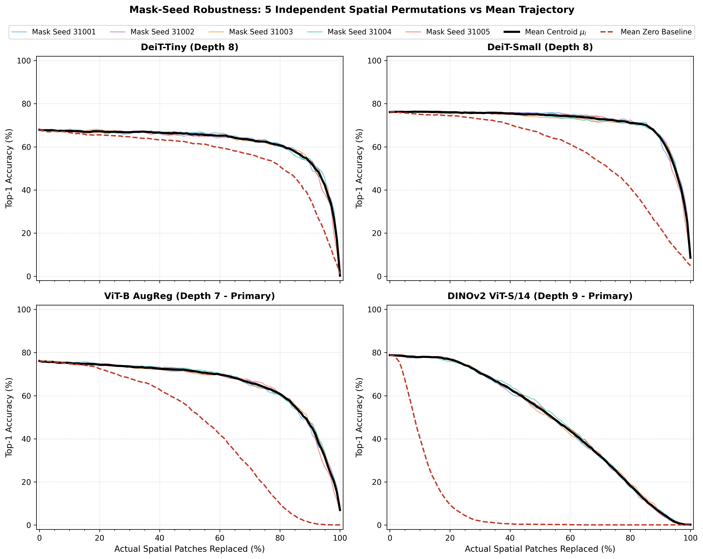
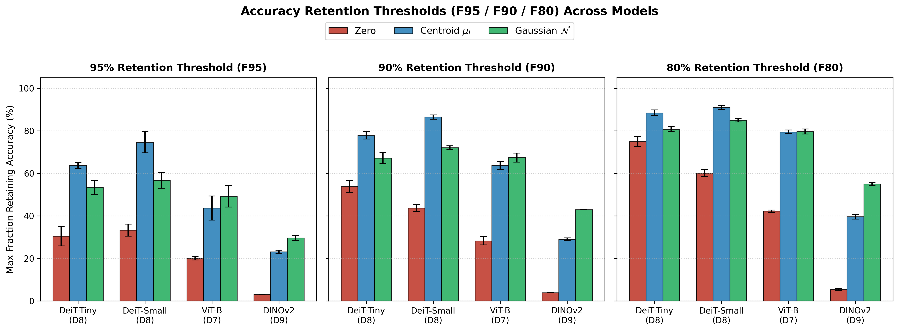
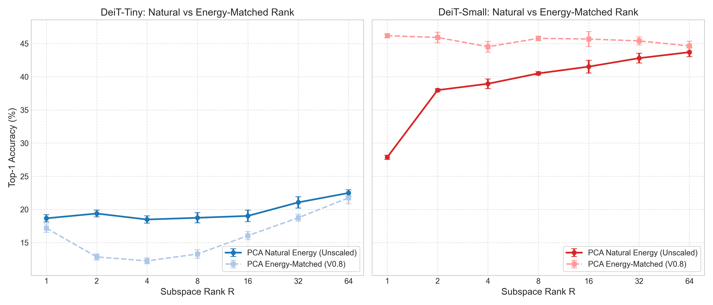
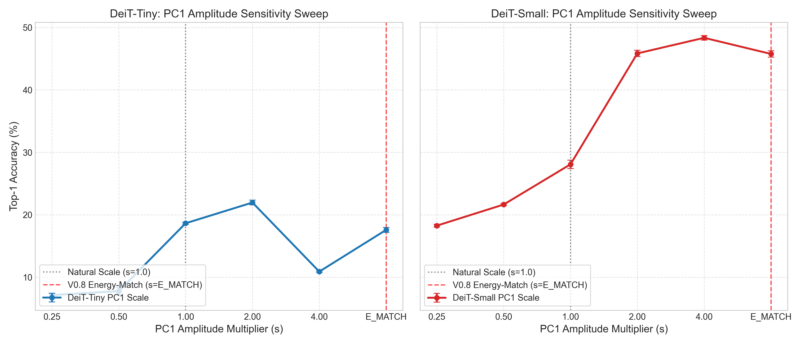
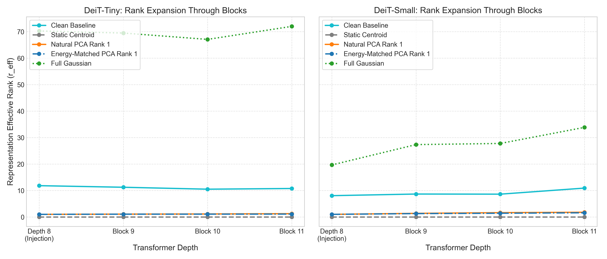
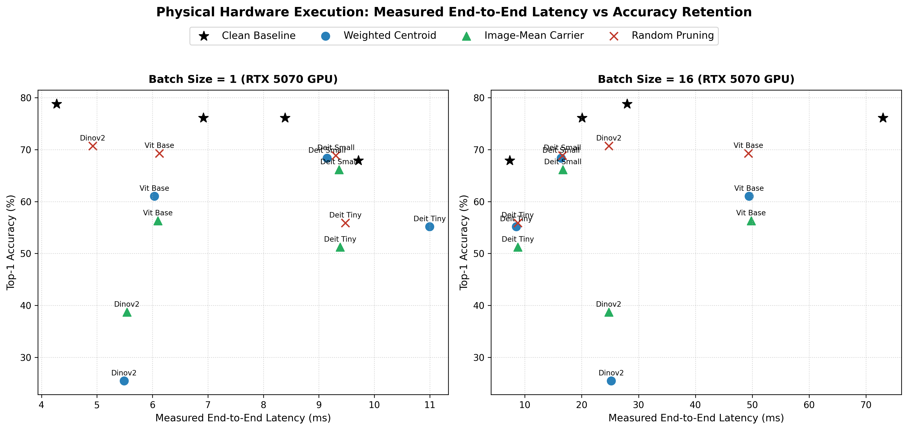

# Supplementary Material
## Patch Content Fungibility in Vision Transformers: Geometric and Diversity Constraints in Late-Layer Representations

> Numerical source of truth: \`docs/PAPER_EVIDENCE_TABLE.md\`.  
> This supplement follows the final audited interpretation of the experiments; historical report wording that was later narrowed is not treated as a paper claim.

## S1. Experimental map

The study was developed as a sequence of falsification experiments rather than as a single post-hoc sweep. Each stage tested a narrower question raised by the preceding result.

| Stage | Main question | Models | Main intervention | Role in final paper |
|---|---|---|---|---|
| V0 | Does zero sensitivity imply exact patch-content dependence? | DeiT-Tiny/Small | Zero, cross-image, shuffle, same-image mean | Discovery |
| V0.5 | Is recovery merely norm matching or generic noise tolerance? | DeiT-Tiny/Small | Sphere, Gaussian, feature shuffle, norm controls | Distribution/geometry falsification |
| V0.6 | Does the effect generalize to held-out statistics, depth, and larger budgets? | DeiT-Tiny/Small | Depth 5--10; 10/25/50%; held-out surrogates | Depth transition + held-out validation |
| V0.7 | How specific is a successful static prototype? | DeiT-Tiny/Small | Wrong-depth means, permutation, sign, scale, cosine; 25--100% | Geometry characterization |
| V0.8 | Why does complete static replacement fail? | DeiT-Tiny/Small | Shared vs. independent noise; grouped diversity; PCA/random | Diversity mechanism |
| V0.9 | Is low-dimensional variation sufficient, and does direction matter? | DeiT-Tiny/Small | Natural PCA ranks, PC identity, amplitude, propagation | Low-dimensional refinement |
| V1 | Does the mechanism replicate outside DeiT? | ViT-B AugReg, DINOv2 | Depth/fraction/geometry/diversity/1D | Cross-family replication |
| Dense robustness | Is the finding caused by lucky fractions or lucky spatial masks? | All four | 101 fractions, five masks | Reviewer-facing robustness |
| Compression POC | Can duplicate surrogate states be collapsed exactly and usefully? | All four | Multiplicity-aware carrier | Boundary test |
| Geometry bank POC | Do generic geometry/diversity carriers beat real patches at fixed token budget? | All four | PCA/K-means/random banks | Application falsification |

All stages use frozen pretrained models. Calibration and evaluation data are disjoint, and no labels or gradients are used to construct the primary calibration-derived replacement vectors.

## S2. Depth transition and held-out generalization

V0.6 separates the central phenomenon from in-sample statistics. Calibration moments are estimated from 1,000 ImageNet-1k validation images and evaluated on a disjoint 1,000-image set, one image per class in each split.

At 25% replacement after Block 8, zero replacement causes margin damage of 0.763 in DeiT-Tiny and 1.432 in DeiT-Small. Held-out diagonal-Gaussian replacement reduces those damages to 0.093 and 0.076, corresponding to 87.9% and 94.7% recovery. The static held-out calibration centroid performs still better, with margin damage 0.048 and 0.035.

The effect is depth-dependent rather than a generic property of any internal layer. In DeiT, Blocks 5--6 remain substantially more content-sensitive; Blocks 7--9 form a replacement-tolerant late region; and by Block 10 the patch stream approaches low causal sensitivity under the tested classification readout. The exact transition is architecture-dependent, as shown by V1, where the strongest window occurs at Block 7 for ViT-B and Block 9 for DINOv2.

A wrong-depth control further shows that coarse distributional compatibility is depth-sensitive. At the Depth-8, 25% operating point, using Depth-5 Gaussian statistics increases margin damage from 0.093 to 0.427 in DeiT-Tiny and from 0.076 to 0.453 in DeiT-Small. Nearby late-depth means can remain compatible, however, which motivates interpreting the late regime as a shared region of compatible feature geometry rather than as one uniquely privileged Block-8 prototype.

## S3. Prototype geometry controls

V0.7 evaluates which properties of a static surrogate are required after Block 8. The central finding is not that the exact centroid is unique, but that successful vectors must remain aligned with the learned feature coordinate system.

At 50% replacement in DeiT-Small, the correct centroid yields 75.6% Top-1 accuracy. A norm-matched vector with cosine alignment 0.0 to the centroid yields 60.1%; increasing the target cosine to 0.25, 0.50, and 0.75 increases accuracy to 71.9%, 74.6%, and 75.6%, respectively. This monotonic trajectory shows that orientation relative to the learned late-layer direction matters beyond vector norm.

Coordinate permutation provides a complementary test because it preserves the multiset of feature values while changing which learned channel receives each value. At 50% replacement, accuracy falls from 66.3% to 52.2% in DeiT-Tiny and from 75.6% to 62.6% in DeiT-Small. Sign inversion is more destructive still. V1 reproduces the geometry requirement in ViT-B and DINOv2, including a drop from 74.6% to 31.8% under coordinate permutation at the tested DINOv2 operating point and to 0.1% under full sign inversion.

These results support the paper's use of **geometry constraint** in a deliberately limited sense: downstream computation is sensitive to feature-coordinate identity, orientation, and compatible scale. They do not establish a complete manifold model of valid representations.

## S4. Replacement fraction and the complete-stream boundary

Partial static replacement is tolerated far beyond the initial 25% intervention. In V0.7, replacing 75% of DeiT-Small spatial patches by the calibration centroid retains 73.6% accuracy from a 76.1% clean baseline; DeiT-Tiny retains 64.2% from 67.9%. At 100% static replacement, however, performance falls sharply to 17.0% and 10.2%, respectively.

The final dense-fraction experiment characterizes this boundary continuously rather than relying on quarter-step fractions. It evaluates 101 requested replacement levels and five independent spatial permutations. Under centroid replacement, DeiT-Tiny retains at least 90% of clean accuracy through \(77.9\%\pm1.7\%\) replacement, and DeiT-Small through \(86.5\%\pm1.0\%\). ViT-B's best primary-depth surrogate reaches \(67.4\%\pm2.1\%\), while DINOv2 reaches \(43.0\%\pm0.0\%\). These values should be interpreted as model-specific operating thresholds, not a universal law.

Across the five tested masks, threshold variability is small relative to the separation between valid surrogates and zero. The result therefore supports robustness across the tested spatial subsets, not strict spatial invariance.

**Supplementary Figure S1. Spatial-mask robustness.** Five independently sampled image-independent spatial permutations are overlaid across the full fraction sweep. The main condition ordering persists across masks.

**Supplementary Figure S2. Accuracy-retention thresholds.** Maximum replacement fractions retaining at least 95%, 90%, and 80% of clean accuracy for zero, centroid, and diagonal-Gaussian interventions.

## S5. Causal isolation of token-to-token diversity

The 100% replacement boundary motivates a direct test of diversity. V0.8 holds the Gaussian marginal distribution fixed while changing only whether one sampled vector is broadcast to every patch or each patch receives an independent sample.

In DeiT-Tiny, shared Gaussian replacement yields 1.02% accuracy, while independent replacement yields 26.34%. In DeiT-Small, the corresponding values are 9.28% and 46.36%. V1 reproduces the effect in ViT-B, with 2.94% versus 14.68%. Because shared and independent conditions use the same per-token distribution, the contrast isolates the importance of variation across the token set rather than merely the energy of a perturbation.

DINOv2 requires a different observable because its official linear readout directly includes the mean patch representation. Under complete replacement both shared and independent conditions remain at the accuracy floor, but the true-class margin improves by 1.124 under independent variation. The paper therefore treats the DINOv2 result as supporting margin-level evidence, not as accuracy rescue.

A grouped-diversity sweep in DeiT additionally shows a monotonic relationship between the number of distinct replacement groups and recovery: increasing the number of independently varying groups progressively improves downstream classification. This supports diversity as a graded computational requirement under complete replacement rather than a binary artifact of one stochastic condition.

## S6. Low-dimensional variation and amplitude controls

V0.9 tests whether diversity must occupy the full feature dimension. Calibration covariance spectra are highly anisotropic, particularly in DeiT-Small, but the final interpretation is more conservative than a rank-one claim.

At 100% replacement, natural PC1 variation yields 18.64% accuracy in DeiT-Tiny and 28.08% in DeiT-Small, compared with 10.80% and 20.78% for energy-matched random one-dimensional directions. V1 strengthens this directional result in ViT-B, where PC1 reaches 40.10% versus 6.70% for the matched random direction. DINOv2 again supports the comparison at the margin level.

Amplitude controls show that direction alone is insufficient. DeiT-Tiny exhibits a non-monotonic response to PC1 scale, while DeiT-Small tolerates a broader high-amplitude range. Earlier apparent rank-one saturation in DeiT-Small was therefore partly amplitude-confounded. The final claim is that **learned low-dimensional variation can provide substantial downstream compatibility and outperforms arbitrary matched directions**, not that the natural late patch stream is intrinsically one-dimensional.

Rank-propagation measurements provide a related diagnostic. A one-dimensional injected patch variation remains dominated by low effective rank as it passes through downstream blocks, while numerical rank increases above one. For this reason the paper avoids the stronger historical phrase “rank-preserving” as a literal rank statement.

## S7. Cross-model forward-parity and readout controls

For ViT-B AugReg and DINOv2, the intervention implementation requires a manual block-by-block forward path. Before intervention experiments, the manual path was checked against the official model forward implementation. Both models achieved exact prediction agreement in the parity audit, and the intervention code leaves pretrained parameters frozen.

The two families also differ in classifier topology. DeiT and ViT-B read classification from [CLS]. The evaluated DINOv2 linear head consumes normalized [CLS] concatenated with the mean normalized patch representation. This distinction explains why direct corruption of the entire patch stream has a stronger observable effect in DINOv2 and is explicitly accounted for in Sections 6--8 of the main paper.

## S8. Compression boundary: exact collapse does not imply competitive compression

The mechanistic finding suggests a natural engineering question: if many late patches can be replaced by the same prototype, can those duplicate prototype states be collapsed?

For the evaluated downstream ViT blocks, \(m\) identical centroid tokens can be represented by one multiplicity-aware carrier by adding \(+\log m\) to its attention logit and, where necessary, using multiplicity-weighted pooling. The implementation reproduces the uncompressed centroid intervention with 100% prediction agreement and maximum absolute logit discrepancy \(4.49\times10^{-5}\).

Sequence reduction produces real computational savings. At batch size 16 on the evaluated RTX 5070 Laptop GPU, the tested ViT-B operating point reduces end-to-end latency from 72.96 ms to 49.42 ms (32.3%), DeiT-Small from 20.06 ms to 16.36 ms (18.4%), and DINOv2 from 27.97 ms to 25.20 ms (9.9%). DeiT-Tiny becomes slower because implementation overhead dominates at its scale.

The carrier is nevertheless not a competitive compression rule. At matched downstream token budgets, random pruning and an unweighted centroid match or outperform the multiplicity-aware carrier. For example, at the tested ViT-B budget, random pruning reaches 72.48% accuracy versus 68.70% for the weighted carrier; in DINOv2 the corresponding values are 77.40% and 71.48%. Therefore the measured latency reduction should be attributed to shorter sequences, not to a superior carrier mechanism.

## S9. Geometry-bank falsification under matched token budgets

A final application test asks whether the failure of one centroid carrier is simply due to insufficient geometry or diversity. At fixed downstream token budget \(B\), we allocate \(K\in\{4,8,16\}\) slots to generic synthetic carriers and the remaining \(B-K\) slots to real image patches. Synthetic banks are constructed using calibration PCA directions, K-means centroids, or matched random directions.

Across all four architectures, both tested budgets per architecture, all three bank families, and five spatial masks, no synthetic bank outperforms the \(K=0\) random-pruning baseline. Increasing \(K\) generally reduces accuracy because each synthetic slot displaces one real image-conditioned patch. This is an empirical token-budget tradeoff; we do not claim to have directly measured mutual information.

The result establishes the boundary summarized in the main text: **replaceability under preserved sequence structure is not equivalent to usefulness under scarce token capacity**.

## S10. Statistical and reproducibility notes

The evaluation image is the independent statistical unit. Calibration and evaluation splits are disjoint. Stochastic replacement seeds are summarized rather than pooled as additional independent samples. Paired margin comparisons, bootstrap confidence intervals, paired parametric and nonparametric tests, effect sizes, and exact McNemar tests are used where applicable, with Benjamini--Hochberg correction within defined comparison families in the stage reports.

The final dense sweep separates spatial-mask seeds from Gaussian-sampling seeds and verifies nested masks, exact integer replacement counts, clean parity at 0%, complete replacement at 100%, calibration-statistic identity, frozen weights, and unique result keys. Machine-readable manifests and result tables are retained under \`outputs/\`, while corresponding publication figures are under \`figures/\`.

## S11. Artifact map

The detailed historical reports remain available for complete numerical traceability:

- \`docs/FUNGIBILITY_V0_REPORT.md\`: initial discovery.
- \`docs/FUNGIBILITY_V0_5_REPORT.md\`: norm/distribution controls.
- \`docs/FUNGIBILITY_V0_6_REPORT.md\`: held-out depth/fraction validation.
- \`docs/FUNGIBILITY_V0_7_REPORT.md\`: prototype specificity and geometry.
- \`docs/FUNGIBILITY_V0_8_REPORT.md\`: complete-replacement diversity.
- \`docs/FUNGIBILITY_V0_9_REPORT.md\`: low-dimensional structure and propagation.
- \`docs/FUNGIBILITY_V1_REPORT.md\`: ViT-B/DINOv2 replication.
- \`docs/FUNGIBILITY_DENSE_FRACTION_REPORT.md\`: continuous fraction and mask robustness.
- \`docs/FUNGIBILITY_COMPRESSION_POC_REPORT.md\`: multiplicity-aware carrier and latency.
- \`docs/FUNGIBILITY_GEOMETRY_BANK_REPORT.md\`: matched-budget synthetic-bank falsification.
- \`docs/PAPER_EVIDENCE_TABLE.md\`: canonical manuscript numbers.
- \`docs/PAPER_CLAIMS_AUDIT.md\`: allowed and disallowed claim boundaries.
